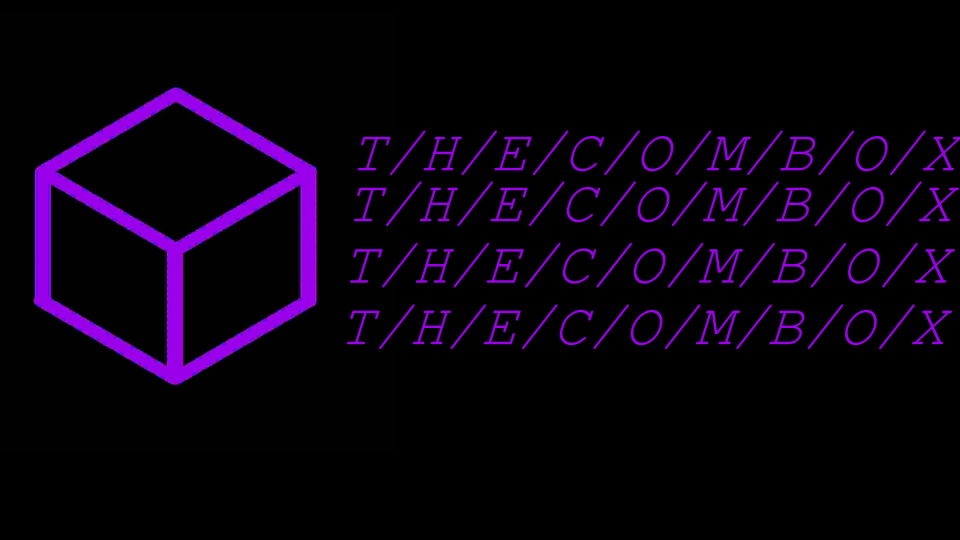
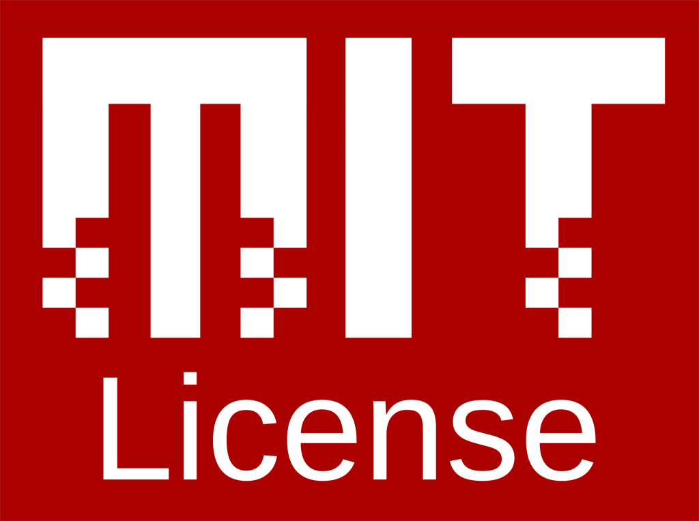

# ComBox Edge



[English](./README.md) | [Русский](./README.ru.md)

Инфраструктурный edge-стек для локальной разработки и безопасного доступа к сервисам Chat. Даёт единый HTTPS-вход, общие core-сервисы (DB/cache/object storage) и админ-инструменты, защищённые VPN + 2FA.

## Powered by

[](https://nginx.org)
[](https://www.postgresql.org)
[](https://valkey.io)
[](https://min.io)
[](https://www.authelia.com)
[](https://www.wireguard.com)
[](https://www.docker.com)
[](https://certbot.eff.org)

## Архитектура (упрощённо)

```text
           Internet / LAN
                 |
                 v
            [ Nginx Edge ]  :443
              |      |
              |      +--> /tools/* (VPN allow-list + Authelia 2FA)
              |
              +--> /api/*, /ws/*, /, /site/
                       |
                       v
               Upstreams (Docker network)
            backend / app / site containers

      Core-сервисы (в этом же docker stack):
      postgres, valkey, minio
```

## Маршрутизация

- `/api/private/*` -> `${BACKEND_UPSTREAM}`
- `/api/public/*` -> `${BACKEND_UPSTREAM}`
- `/ws/*` -> `${BACKEND_UPSTREAM}`
- `/` -> `${APP_UPSTREAM}`
- `/site/` -> `${SITE_UPSTREAM}`
- `/tools/minio/` -> MinIO Console (только VPN)
- `/tools/db/` -> админка PostgreSQL (только VPN)
- `/tools/logs/` -> UI логов (только VPN)
- `/tools/wireguard/` -> WireGuard UI (только VPN + 2FA)
- `/healthz` -> статичный 200 `ok`

Заголовки:

- `X-Client-Locale` берётся из `Accept-Language` (fallback `EDGE_DEFAULT_LOCALE`).

## Структура репозитория

- Compose: `docker-compose.yml`
- Env: `.env` и `.env.example`
- Nginx template: `nginx/default.conf.template`
- Authelia templates: `authelia/*.template.yml`
- Valkey config: `valkey/valkey.conf`
- Postgres init scripts: `postgres/init/*.sql`
- MinIO init scripts: `minio/init/*.sh`
- Локализованные строки: `strings/*.json`

## Быстрый старт

```bash
cp .env.example .env
# отредактируй .env (порты/секреты/upstreams)

docker compose --env-file .env -f docker-compose.yml up -d
```

Дефолты для gateway-режима:

- `BACKEND_UPSTREAM=chat-backend:8080`
- `APP_UPSTREAM=chat-app:4173`

Ожидается, что backend и app запускаются в отдельных compose-стеках, но подключены к сети `chat-edge-core`.

### Подключение внешних backend/app к edge

1. Подними edge core:

```bash
make up
```

2. Запусти backend в edge-сети (без проброса портов на хост):

```bash
cd ../chat-backend
make edge-up
```

3. Запусти app в edge-сети (без проброса портов на хост):

```bash
cd ../chat-app
make edge-up
```

В этом режиме backend/app принимают трафик только от peer-контейнеров в Docker-сети (через edge nginx), а не по прямым хостовым HTTP-портам.

## Выбор админки БД

Выбери один вариант в `.env`:

- `ADMIN_UI=pgweb`
- `COMPOSE_PROFILES=admin-pgweb`

или

- `ADMIN_UI=pgadmin`
- `COMPOSE_PROFILES=admin-pgadmin`

При переключении админки один раз удали старый контейнер:

- переключение на `pgweb`: `docker rm -f chat-pgadmin || true`
- переключение на `pgadmin`: `docker rm -f chat-pgweb || true`

Или просто используй `make up` (он чистит старый контейнер автоматически).

## TLS (авто-обновление)

- Edge поднимает HTTP/HTTPS на `EDGE_HTTP_PORT`/`EDGE_HTTPS_PORT` (по умолчанию `80/443`).
- `tls-init` создаёт временный self-signed сертификат для первого запуска.
- `certbot` запрашивает и продлевает Let’s Encrypt сертификаты автоматически.
- `nginx` следит за файлами сертификата и делает reload при обновлении.

Для прод-выдачи сертификата укажи в `.env`:

- `EDGE_TLS_DOMAIN=<your-domain>`
- `CERTBOT_EMAIL=<your-email>`
- `CERTBOT_STAGING=0`

## VPN (WireGuard) и безопасность tools

- UDP endpoint WireGuard остаётся публичным: `${WG_PORT}` (по умолчанию `51820/udp`).
- WG UI доступен только через edge-роут и требует 2FA:
  - `https://<server-host>/tools/wireguard/`
- Прямой доступ к `wg-ui` по TCP порту на хосте отключён.

Доступ к `/tools/*` защищён двумя слоями:

- allow-list по сети (`VPN_CIDR` / `VPN_DOCKER_CIDR`)
- Authelia two-factor authentication (обязательно)

Защищённые endpoints:

- `/tools/`
- `/tools/db/`
- `/tools/minio/`
- `/tools/logs/`
- `/tools/wireguard/`

### Пароль WireGuard UI

Пароль для входа в `wg-easy` задаётся через `WG_PASSWORD_HASH`.

Сгенерировать bcrypt-хэш:

```bash
docker run --rm ghcr.io/wg-easy/wg-easy:latest \
  node -e 'const b=require("bcryptjs"); console.log(b.hashSync("your_password",10));'
```

Сохрани результат в `.env` как `WG_PASSWORD_HASH=...` и экранируй `$` как `$$`.

### Настройка Authelia

Секреты Authelia в `.env`:

- `EDGE_AUTHELIA_SESSION_DOMAIN`
- `EDGE_AUTHELIA_SESSION_SECRET`
- `EDGE_AUTHELIA_STORAGE_ENCRYPTION_KEY`
- `EDGE_AUTHELIA_IDENTITY_VALIDATION_RESET_PASSWORD_JWT_SECRET`

Админ-пользователь Authelia в `.env` (без ручного редактирования YAML):

- `EDGE_AUTHELIA_ADMIN_USERNAME`
- `EDGE_AUTHELIA_ADMIN_DISPLAYNAME`
- `EDGE_AUTHELIA_ADMIN_EMAIL`
- `EDGE_AUTHELIA_ADMIN_PASSWORD_HASH` или `EDGE_AUTHELIA_ADMIN_PASSWORD`

Предпочтительнее хэш. Argon2id-хэш:

```bash
docker run --rm authelia/authelia:latest authelia crypto hash generate argon2 --password 'your_strong_password'
```

Сохрани digest в `.env` как `EDGE_AUTHELIA_ADMIN_PASSWORD_HASH=...`. Если в хэше есть `$`, экранируй каждый `$` как `$$`.

Режим нескольких аккаунтов:

- `EDGE_AUTHELIA_USERS=admin,devops,...`
- Для каждого пользователя `name` задай:
  - `EDGE_AUTHELIA_USER_<NAME>_EMAIL`
  - `EDGE_AUTHELIA_USER_<NAME>_DISPLAYNAME` (опционально; по умолчанию = username)
  - `EDGE_AUTHELIA_USER_<NAME>_PASSWORD_HASH` или `EDGE_AUTHELIA_USER_<NAME>_PASSWORD`

`<NAME>` — это username в UPPERCASE, где все не-алфанумерик символы заменены на `_`.

### Первичное подключение 2FA

1. Открой `https://<server-host>/tools/wireguard/`.
2. Войди под пользователем Authelia.
3. Зарегистрируй TOTP в приложении (Aegis/Authy/Google Authenticator).
4. После этого для tools потребуется пароль + TOTP код.

## Логи Nginx

- JSON access logs: volume `nginx_logs` -> `/var/log/nginx/access.log`
- Error logs: volume `nginx_logs` -> `/var/log/nginx/error.log`

Просмотр логов:

```bash
docker compose --env-file .env logs -f nginx
```

## Troubleshooting

- Если порт занят — поменяй в `.env` (например `VALKEY_PORT=6380`).
- Скрипты `postgres/init` выполняются только при первом создании свежего volume.
- Путь админки PostgreSQL всегда `/tools/db/`, а контейнер выбирается через profile (`admin-pgweb` или `admin-pgadmin`).

## Примечания

- Используй один compose-файл (`docker-compose.yml`), чтобы не было рассинхронизаций конфигов.
- Пользовательские сообщения/лейблы держи в `strings/` и избегай хардкода в edge-скриптах/шаблонах.

## License

<a href="./LICENSE">
  
</a>

## Author

[Ernela](https://github.com/Ernous) - Разработчица;
[D7TUN6](https://github.com/D7TUN6) - Идея, Разработчик
